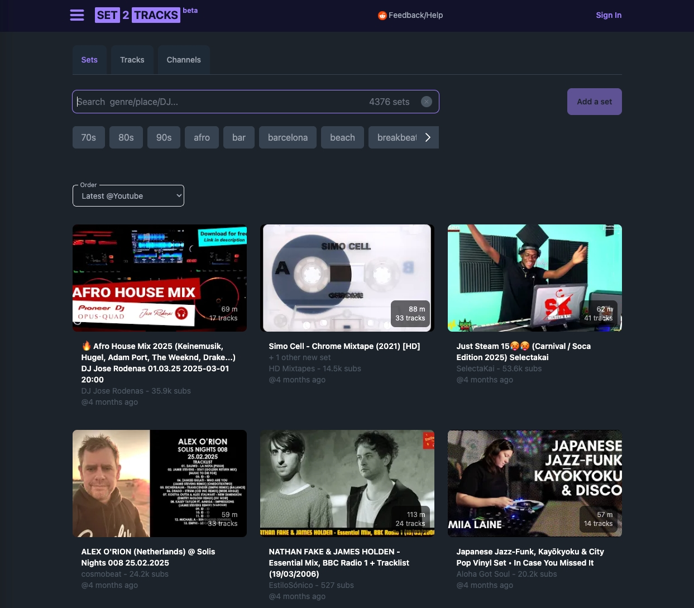

# Set2Tracks is Dead… and Alive!



## Context

In early 2025, Set2Tracks got a warm welcome in this [r/beatmatch thread](https://www.reddit.com/r/Beatmatch/comments/1i2pohr/a_free_tool_to_discover_tracks_from_dj_sets/).  
Thanks to everyone who checked it out, upvoted, and sent feedback!

## What is it?

Set2Tracks is a free tool that helps DJs and music lovers discover new tracks, by automatically converting YouTube DJ sets into full tracklists.

You can quickly scan entire sets, listen to previews, browse tracks by genre or label, and link straight to Spotify or Apple Music (support the artists, yo).

This all came from my own frustration trying to ID tracks in the sets I liked.  
Maybe it helps others too—whether you're digging for new sounds, prepping for a gig, or just building a collection.

## So, what happened?

I thought about turning it into a Chrome extension so users could add their own sets (maybe with a small subscription).  
But hosting costs would’ve gone up, since every set needs to be downloaded and processed…

And honestly, this is one of those tools people love to find for free—but wouldn’t really pay for (there’s no strong PAIN POINT here, and, well… DJs aren’t known for paying for this stuff).  
Promotion? Not easy:  
Reddit worked once, but mod teams are ruthless (even for free stuff—been there, deleted that).  
Elsewhere? Not without $$$ and very uncertain ROI.

Plus, life called: I’ve got other, more urgent priorities right now (like actually making a living…).  
So I can’t go all-in on this, even though I still think it’s cool and appreciated all the encouragement. I don’t want it to totally disappear.

## So… here’s the codebase.

Yeah, it’s straight-up shameful, messy, spaghetti beginner code.  
I’m frankly not proud of it.  
But it works, and maybe you’ll find something useful.

## DON’T:  
Ask me for help with the codebase—really, sorry, I don’t have the bandwidth.

## DO:  
Let me know if you do anything with it!  
[Ping me on Reddit](https://www.reddit.com/user/Doodadio/)


# Working on my machine so far

Python 3.11.5 (Naked, in a virtual environment)


# Install

## First Get the thing, yep...

```
gh repo clone davstr1/set2tracks
or just download it.

## 1 - Setup 

On terminal

You probably want to be inside a new virtual env first. (pyenv)

```
./setup.sh
```

## 2 - Fill app/web/.env with your data

# Run

Tailwind procesor (to monitor and update your css changes in tailwind)
From ./tailwind folder :
```
npx tailwindcss -i ../app/web/static/css/tailwind/input.css -o ../app/web/static/css/tailwind/output.css --watch

```
The actual app
```
python app/web/run.py
```

## Or manual install

### 1 - Install python dependencies

```
pip install -r requirements.txt
```

### 2 - Edit environment variables

Copy example.env into a .env, and fill it with your data.


## Notes

- PROD : All you really need in prod is the content of the "web" folder.


# Styling and Templates

Most templates are in the package (boilerplate)
Like login, registration, header etc..
But you can overwrite anything, just copying the corresponding templates 

from 
./boilersaas/src/boilersaas/templates
to
./web/templates 


and then edit them there.


# Still here ??

Great !